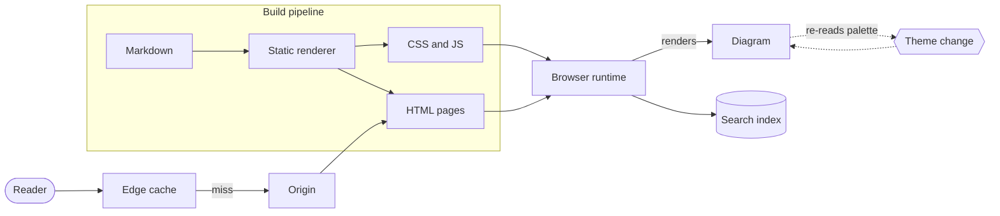
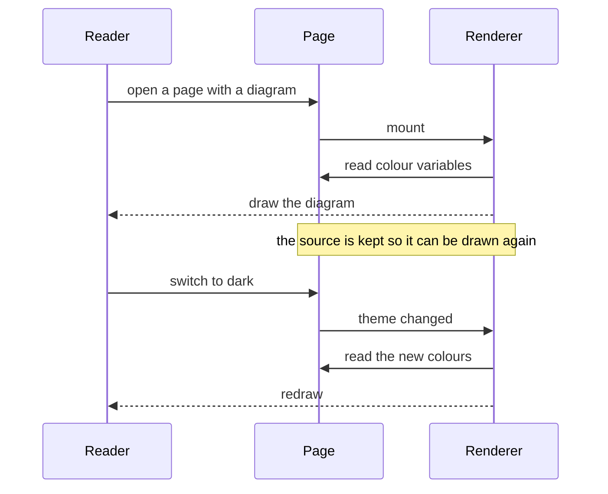
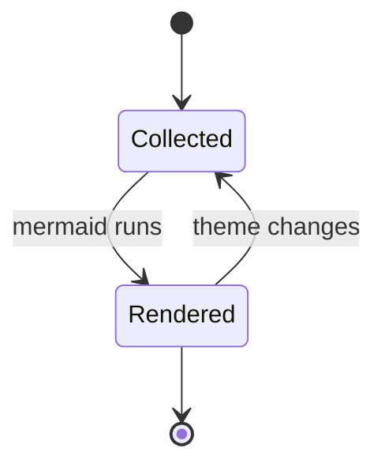

Write a fenced `mermaid` block and it is drawn in the site's own colours. Node
fills, borders, edge lines and label text all come from the theme, so a diagram
follows dark and light without any per-diagram configuration.

## Flowchart

Subgraphs, node shapes and edge labels are all styled from the same palette.

## Sequence

A different diagram type, drawn from the same colour variables.

## State

